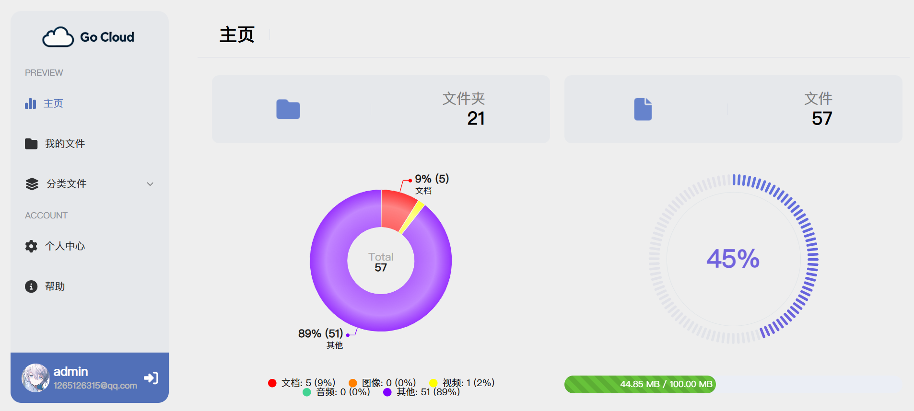
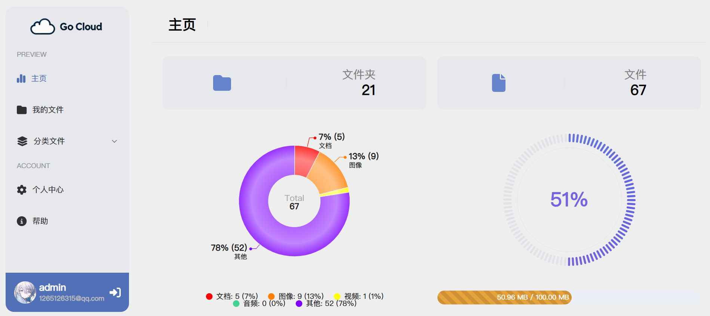
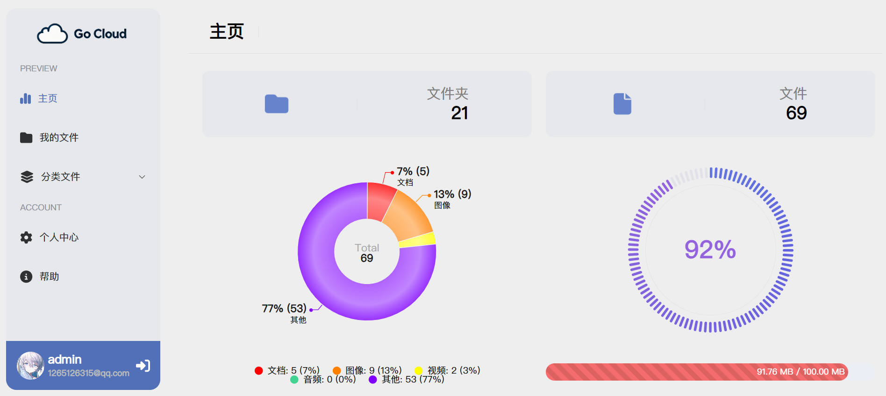
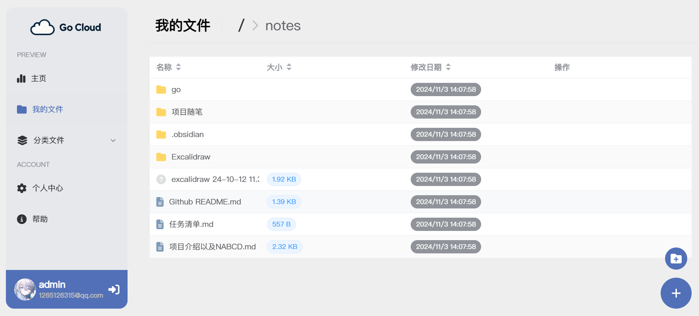
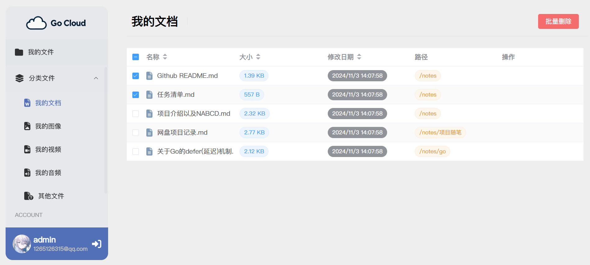
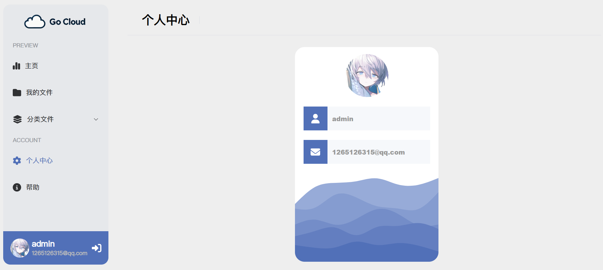

## Contents

- [Introduction](#introduction)
- [FrameWork](#framework)
- [Feature](#feature)
- [Team](#team)
- [Snippets](#snippets)

## Introduction

**Go Cloud** is a self-developed cloud storage project aimed at providing users with a cloud based file storage repository. **Go Cloud** allows users to **view files** in the repository at any time, **download** and **upload** local files, and **share files** in the repository for other users to download through sharing links.

## FrameWork

- Front-End: vue 3、typescript、element-plus、vue-data-UI、fontawesome、vue-router、axios
- Back-End: golang、gin、gorm
- Database: mysql、redis

## Feature

1. **Safe**: **Go Cloud** has implemented a personalized file repository, allowing users to confidently upload important files to the cloud without worrying about data breaches；
2. **Quick**：When uploading and downloading files, **Go Cloud** adopts **large file sharding** technology, which can effectively accelerate the upload and download of large files and reduce user waiting time；
3. **Simple**：The UI design of the **Go Cloud** page is simple yet not simplistic. Through clear and easy to understand graphical operations, users can easily get started without extra learning. Moreover, **Go Cloud** does not have a VIP mechanism, and users can enjoy all the functions of the cloud storage without recharging。

## Team

**归零、怪咖、你追立必点炮、温柔\_婉柔.、十二**

## Snippets

